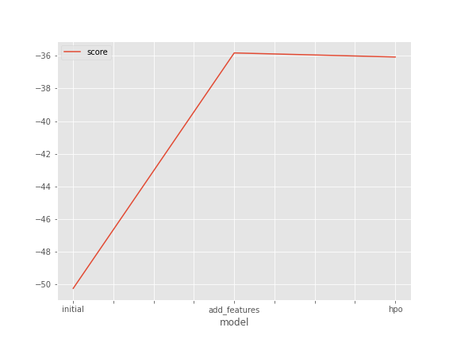
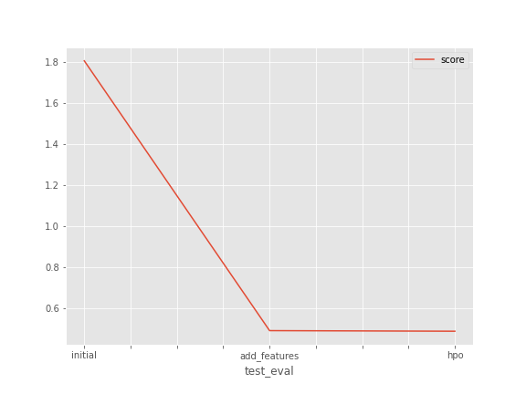

# Report: Predict Bike Sharing Demand with AutoGluon Solution
### Mahmoud Ali

## Initial Training
### What did you realize when you tried to submit your predictions? What changes were needed to the output of the predictor to submit your results?
#### >> predictions will be negative so we should ignore negative prediction by set them to zero

### What was the top ranked model that performed?
#### >>WeightedEnsemble_L3  

## Exploratory data analysis and feature creation
### What did the exploratory analysis find and how did you add additional features?
#### >>we  Create a histogram of all features to show the distribution of each one relative to the data
#### >> create a new feature from 
#### >> 1- separate the datetime to year,month,day and hour 
#### >>2-Feature that categorizes morning, lunch, and evening rush hour, 7-9am, 11am-1pm, and 5-6pm.
#### >>3-Feature that categorizes hot/cold/mild temps from temp.
#### >>4-Feature that categories very windy/mild wind.
#### >>5-Feature that categories very humid/ not humid

### How much better did your model preform after adding additional features and why do you think that is?
#### >>The performance of the model has more than doubled almost as a result of adding new features
#### >>Which provided the model with new features to work on
## Hyper parameter tuning
### How much better did your model preform after trying different hyper parameters?
#### >> The performance of the model is slightly improved

### If you were given more time with this dataset, where do you think you would spend more time?
#### >> i will spend more time trying to tuning Hyperparameters to optimize the model performance
### Create a table with the models you ran, the hyperparameters modified, and the kaggle score.
|model|num_bag_folds|num_bag_sets|num_stack_levels|score|
|--|--|--|--|--|
|initial|default|default|default|1.80644|
|add_features|default|default|default|0.48943|
|hpo|10|10|5|0.48652|

### Create a line plot showing the top model score for the three (or more) training runs during the project.

TODO: Replace the image below with your own.

### Create a line plot showing the top kaggle score for the three (or more) prediction submissions during the project.

TODO: Replace the image below with your own.

## Summary
TODO: Add your explanation
